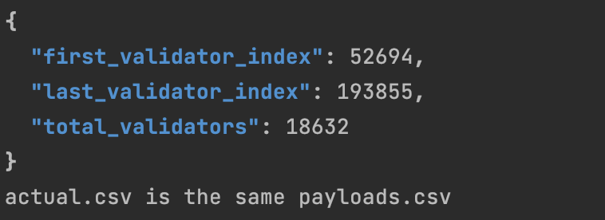

# How to get signatures of BlsExecutionChange container.

Ethereum staking started with only one type of withdrawal credential, called 0x0. This allowed only a BLS address type to be the owner of a validator.
In December 2020, the introduction of 0x01 allowed Ethereum addresses to own a validator.
To switch the withdrawal credentials of an existing validator, one would have to unstake the ETH and then restake it with the new credentials. However, unstaked ETH cannot be restaked until withdrawals are enabled. So to switch from 0x0 to 0x01 today, a special mechanism is required, which would allow validators to switch their withdrawal credentials “in-flight.”
There are [18,632 Lido validators](./pkg/wc_rotation/payloads.csv) using 0x00 withdrawal credentials. To rotate them to 0x01, Lido has developed the dc4bc software with recently added batch-signing capability.

### Command
```
./dc4bc_cli sign_baked [dkg_id] [range_start] [range_end]
```
* `dkg_id`: The hash of dkg round.
* `range_start`: "From" index in the [payloads.csv](./pkg/wc_rotation/payloads.csv)
* `range_end`: "Finish" index in the [payloads.csv](./pkg/wc_rotation/payloads.csv)
    #### Example
    `range_start, range_end` - are sequence numbers of the validators in the file, not their indexes.
    ```
    $ ./dc4bc_cli sign_baked d62c6c478d39d4239c6c5ceb0aea6792 0 100
    $ ./dc4bc_cli sign_baked d62c6c478d39d4239c6c5ceb0aea6792 100 500
    ...
    $ ./dc4bc_cli sign_baked d62c6c478d39d4239c6c5ceb0aea6792 18000 18632
    ```

### Eth variables and them to check
For rotation 0x00 withdrawal credential to 0x01, it needed to send a [SignedBLSToExecutionChange](https://github.com/ethereum/consensus-specs/blob/dev/specs/capella/beacon-chain.md#signedblstoexecutionchange) to the eth network.
```python
class SignedBLSToExecutionChange(Container):
    message: BLSToExecutionChange
    signature: BLSSignature
```
Filling up [SignedBLSToExecutionChange](https://github.com/ethereum/consensus-specs/blob/dev/specs/capella/beacon-chain.md#signedblstoexecutionchange) requires another container 
[BlsToExecutionChange](https://github.com/ethereum/consensus-specs/blob/dev/specs/capella/beacon-chain.md#blstoexecutionchange) and his signature.

```python
class BLSToExecutionChange(Container):
    message: BLSToExecutionChange
    signature: BLSSignature
```
```python
class BLSToExecutionChange(Container):
    validator_index: ValidatorIndex
    from_bls_pubkey: BLSPubkey
    to_execution_address: ExecutionAddress
 ```
* [ValidatorIndex](https://github.com/ethereum/consensus-specs/blob/5337da5dff85cd584c4330b46a881510c1218ca3/specs/phase0/beacon-chain.md#custom-types) - uint64 a validator registry index
* [BLSPubkey](https://github.com/ethereum/consensus-specs/blob/5337da5dff85cd584c4330b46a881510c1218ca3/specs/phase0/beacon-chain.md#custom-types) - Bytes48 a BLS12-381 public key
* [ExecutionAddress](https://github.com/ethereum/consensus-specs/blob/6181035d5ddef4b668d0fcfee460da9888009dd9/specs/bellatrix/beacon-chain.md#custom-types) - Bytes20	Address of account on the execution layer
* [BLSSignature](https://github.com/ethereum/consensus-specs/blob/5337da5dff85cd584c4330b46a881510c1218ca3/specs/phase0/beacon-chain.md#custom-types) - Bytes96	a BLS12-381 signature

Dc4bc contains itself list of validator indexes embedded in [payload.csv](./pkg/wc_rotation/payloads.csv). Also, dc4bc predefined other values hex formatted and unit tests for them, such as:

* [CapellaForkVersion](https://github.com/ethereum/consensus-specs/blob/dev/specs/capella/fork.md#configuration):
  * ``0x03000000``
  * ``[4]byte{3, 0, 0, 0}``
* [DomainBlsToExecutionChange](https://github.com/ethereum/consensus-specs/blob/dev/specs/capella/beacon-chain.md#domain-types): 
    * ``0x0A000000``
    * ``[4]byte{10, 0, 0, 0}``
* [LidoBlsPubKeyBB](https://blog.lido.fi/lido-withdrawal-key-ceremony/)
  * base64 ``tnrKcfBLZzA3tUAJt2Dxlh84NuVxQUHIkq/bdewINNzmeE2ccu2K19syjP+P6fE+``
  * hex ``0xb67aca71f04b673037b54009b760f1961f3836e5714141c892afdb75ec0834dce6784d9c72ed8ad7db328cff8fe9f13e``
  * bytes ``[48]byte{182, 122, 202, 113, 240, 75, 103, 48, 55, 181, 64, 9, 183, 96, 241, 150, 31, 56, 54, 229, 113, 65, 65, 200, 146, 175, 219, 117, 236, 8, 52, 220, 230, 120, 77, 156, 114, 237, 138, 215, 219, 50, 140, 255, 143, 233, 241, 62}``
* [ExecutionAddress](https://mainnet.lido.fi/#/lido-dao/0x2e59a20f205bb85a89c53f1936454680651e618e/vote/78/)
  * ``0xb9d7934878b5fb9610b3fe8a5e441e8fad7e293f``
  * ``[20]byte{185, 215, 147, 72, 120, 181, 251, 150, 16, 179, 254, 138, 94, 68, 30, 143, 173, 126, 41, 63}``
* ``GenesisValidatorRoot`` // {beacon api}/eth/v1/beacon/genesis
  * ``0x4b363db94e286120d76eb905340fdd4e54bfe9f06bf33ff6cf5ad27f511bfe95``
  * ``[32]byte{75, 54, 61, 185, 78, 40, 97, 32, 215, 110, 185, 5, 52, 15, 221, 78, 84, 191, 233, 240, 107, 243, 63, 246, 207, 90, 210, 127, 81, 27, 254, 149}``

Each value covered by unit test [here](./pkg/wc_rotation/variables_test.go)

### How we've collected [payloads.csv](./pkg/wc_rotation/payloads.csv).
The validator's list was collected by [wc-collector](https://github.com/sergeyWh1te/wc-collector). It searches validator indexes with 0x00 Lido's wc([0x009690e5d4472c7c0dbdf490425d89862535d2a52fb686333f3a0a9ff5d2125e](https://mainnet.lido.fi/#/lido-dao/0x2e59a20f205bb85a89c53f1936454680651e618e/vote/0/)) and stores them into db.
Image with data can be found in [one docker hub](https://hub.docker.com/r/snack008/wc-exchange-postgres).The data with validator indexes has been saved in [payload.csv](./pkg/wc_rotation/payloads.csv)

### How to test payload.csv
Dc4bc contains itself [payload_csv_test.sh](./pkg/wc_rotation/payload_csv_test.sh). For his work, it's required to install utility
[jq](https://stedolan.github.io/jq/download/) for your os. Also, when you run the script, it asks from a user ``Please provide the HOST for the ETH beacon node.`` like [Infura](https://infura.io/), [Alchemy](https://alchemy.com), or your custom node.

During working [payload_csv_test.sh](./pkg/wc_rotation/payload_csv_test.sh), it fetches data with all validators in ETH blockchain. Then filters validators with Lido's 0x00 wc ([0x009690e5d4472c7c0dbdf490425d89862535d2a52fb686333f3a0a9ff5d2125e](https://mainnet.lido.fi/#/lido-dao/0x2e59a20f205bb85a89c53f1936454680651e618e/vote/0/))
Stores filtered data into `actual.csv` and using `diff` shows the difference between `actual.csv` and `payload.csv`. To pass a test, the content must be the same.

Here's an example of a successful result.
